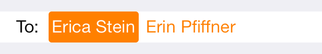

MBContactPicker
===============

## Synopsis

MBContactPicker is an implementation of a contact picker that looks like the one in Apple mail for iOS7. This can be dropped into any project, using interface builder and a few simple lines of code, you can have this custom contact picker into your app in very little time.

I wrote this library to provide an update to the awesome THContactPicker that our company used in the past. My main goal when I created this library was to build something that behaved and felt like the native mail app's contact selector.

My secondary goal was to make using it extremely simple while still providing a high level of flexibility for projects that need it.


## Code Example

If you don't already have a contact model class, you can use `MBContactModel`, the default implementation available. If you already have a contact object, you will need to update it to implement the `MBContactPickerModelProtocol` as shown below:

#### Header

```objc
#import "MBContactModel.h"

@interface ContactObject : NSObject <MBContactPickerModelProtocol>
...
// Required
@property (nonatomic, copy) NSString *contactTitle;
// Optional
@property (nonatomic, copy) NSString *contactSubtitle;
@property (nonatomic) UIImage *contactImage;
...
@end
```

### ViewController Code

Below you'll find a rudimentary example of a view controller using `MBContactPicker`.

```objc

#import "ViewController.h"
#import "ContactObject.h"
#import "MBContactPicker.h"

@interface ViewController () <MBContactPickerDataSource, MBContactPickerDelegate>

@property (nonatomic) NSArray *contacts;
@property (weak, nonatomic) IBOutlet MBContactPicker *contactPickerView;
@property (weak, nonatomic) IBOutlet NSLayoutConstraint *contactPickerViewHeightConstraint;

@end

@implementation ViewController

- (void)viewDidLoad
{
    [super viewDidLoad];
    
    NSArray *array = @[
                       @{@"Name":@"Contact 1", @"Title":@"CTO"},
                       @{@"Name":@"Contact 2", @"Title":@"CEO"}
                       ];
    
    NSMutableArray *contacts = [[NSMutableArray alloc] initWithCapacity:array.count];
    for (NSDictionary *contact in array)
    {
        ContactObject *model = [[ContactObject alloc] init];
        model.contactTitle = contact[@"Name"];
        model.contactSubtitle = contact[@"Title"];
        [contacts addObject:model];
    }
    self.contacts = contacts;
    
    self.contactPickerView.delegate = self;
    self.contactPickerView.datasource = self;
}

#pragma mark - MBContactPickerDataSource

// Use this method to give the contact picker the entire set of possible contacts.  Required.
- (NSArray *)contactModelsForContactPicker:(MBContactPicker*)contactPickerView
{
    return self.contacts;
}

// Use this method to pre-populate contacts in the picker view.  Optional.
- (NSArray *)selectedContactModelsForContactPicker:(MBContactPicker*)contactPickerView
{
    return @[];
}

#pragma mark - MBContactPickerDelegate

// Optional
- (void)contactCollectionView:(MBContactCollectionView*)contactCollectionView didSelectContact:(id<MBContactPickerModelProtocol>)model
{
    NSLog(@"Did Select: %@", model.contactTitle);
}

// Optional
- (void)contactCollectionView:(MBContactCollectionView*)contactCollectionView didAddContact:(id<MBContactPickerModelProtocol>)model
{
    NSLog(@"Did Add: %@", model.contactTitle);
}

// Optional
- (void)contactCollectionView:(MBContactCollectionView*)contactCollectionView didRemoveContact:(id<MBContactPickerModelProtocol>)model
{
    NSLog(@"Did Remove: %@", model.contactTitle);
}

// Optional
// This delegate method is called to allow the parent view to increase the size of
// the contact picker view to show the search table view
- (void)didShowFilteredContactsForContactPicker:(MBContactPicker*)contactPicker
{
    if (self.contactPickerViewHeightConstraint.constant <= contactPicker.currentContentHeight)
    {
        [UIView animateWithDuration:contactPicker.animationSpeed animations:^{
            CGRect pickerRectInWindow = [self.view convertRect:contactPicker.frame fromView:nil];
            CGFloat newHeight = self.view.window.bounds.size.height - pickerRectInWindow.origin.y - contactPicker.keyboardHeight;
            self.contactPickerViewHeightConstraint.constant = newHeight;
            [self.view layoutIfNeeded];
        }];
    }
}

// Optional
// This delegate method is called to allow the parent view to decrease the size of
// the contact picker view to hide the search table view
- (void)didHideFilteredContactsForContactPicker:(MBContactPicker*)contactPicker
{
    if (self.contactPickerViewHeightConstraint.constant > contactPicker.currentContentHeight)
    {
        [UIView animateWithDuration:contactPicker.animationSpeed animations:^{
            self.contactPickerViewHeightConstraint.constant = contactPicker.currentContentHeight;
            [self.view layoutIfNeeded];
        }];
    }
}

// Optional
// This delegate method is invoked to allow the parent to increase the size of the
// collectionview that shows which contacts have been selected. To increase or decrease
// the number of rows visible, change the maxVisibleRows property of the MBContactPicker
- (void)contactPicker:(MBContactPicker*)contactPicker didUpdateContentHeightTo:(CGFloat)newHeight
{
    self.contactPickerViewHeightConstraint.constant = newHeight;
    [UIView animateWithDuration:contactPicker.animationSpeed animations:^{
        [self.view layoutIfNeeded];
    }];
}

@end

```

### Customization/Configuration

#### Change Color of the Selected Contacts

Thanks to [Roman](http://github.com/firmach) for this enhancement.

```objc
[[ContactCollectionViewCell appearance] setTintColor:[UIColor orangeColor]];
```



#### Suppress completion of alread-selected contacts

By default, the picker shows you contacts which have already been added to the collection as options for completion, but discards them when you choose them, to prevent duplicate contacts in the collection. This is to be consistent with the behavior of Apple's ```Mail.app```, but is arguably a deficient user experience. To suppress the already-chosen contacts from the completion list, you can set the following property:

```objc
self.contactPickerView.allowsCompletionOfSelectedContacts = NO;
```

#### Enabling/Disabling

The ```MBContactPicker``` control's enabledness can be toggled by setting it's ```-enabled``` property.  ```MBContactCollectionView``` has two properties, ```-allowsSelection``` and ```-allowsTextInput``` that control whether contact cells can be selected/deleted and searching/adding new contacts, respectively.

#### UIResponder
```MBContactPicker``` and ```MBContactCollectionView``` both adhere to the UIResponder protocol.  ```objc_msgSend``` ```becomeFirstResponder``` and ```resignFirstResponder``` away!

## Motivation

This project exists to because no other cocoapods existed that solved the problem of providing a robust contact selector that was easy to implement, used the latest iOS tools, and matched the appearance of iOS7's flat design.

## Installation

Edit your `PodFile` to include the following line:

```
pod 'MBContactPicker'
```

## Contributors

I am actively maintaining this along with the team at [Citrrus](http://www.citrrus.com), so please fork our project and make it better!

Special thanks to [Matt Hupman](http://github.com/mhupman) for putting this library into a project and providing feedback and PRs to make it better.

## License

This project uses the MIT license, so there are no strings attached.
